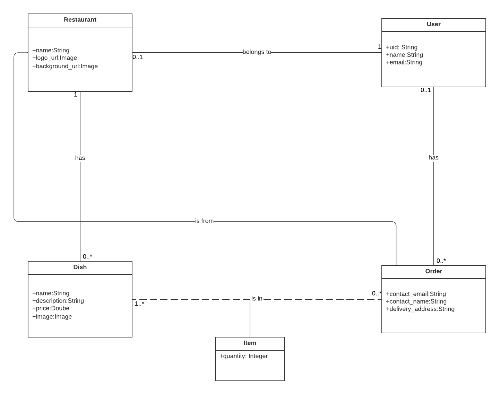

# Description

Food ordering app, with multiple restaurants. Users can create a restaurant and adding dish in responding restaurant. 
## Tech stack
```
NodeJS/Express
Postgres
Javascript
ReactJS (Hooks, Routers, Redux)
HTML/CSS/TailwindCSS
```


# Run locally
## Front end 
 
```
cd front-end
npm ci
npm start
```
### Enviroment variables.

| Variable Name           | Description                                                                                                 |
|-------------------------|-------------------------------------------------------------------------------------------------------------|
| REACT_APP_SERVER_URL            | URL of the backend |

## Back end 

```
cd front-end
npm ci
npm start
```

### Database
Set up a database using the schema.sql.


### Enviroment variables.

| Variable Name           | Description                                                                                                 |
|-------------------------|-------------------------------------------------------------------------------------------------------------|
| CONNECTIONSTRING            | Connection string of POSTGRES SQL. |
| CREDS            | Service account of Firebase server. |

Be aware that you need to enable your traffic in the Security Settings of your Google Firebase project.

## Using Docker
Alternatively you can use Docker to run the application.


To start, use
```
docker compose up
```
### Enviroment variables.
| Variable Name           | Description                                                                                                 |
|-------------------------|-------------------------------------------------------------------------------------------------------------|
| PG_PASSWORD            | Password of for the PostgresSQL server |
| CREDS            | Service account of Firebase server. |

To clean up after using, use

```
docker compose down --remove-orphans -v
```


# Bussiness model

